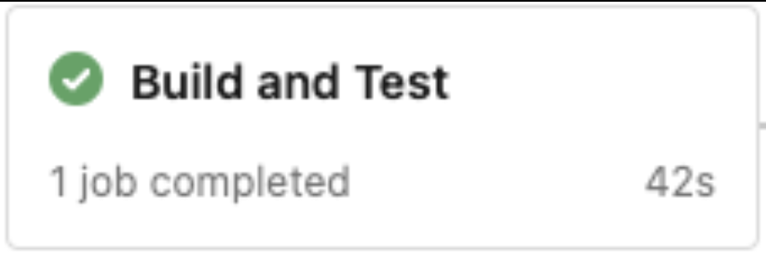

# Build Pipelines

## 1. Introduction

This document describes the implementation of the concepts found in the [CI/CD Deployment standards document](https://scm.starbucks.com/starbucks-martech/martech-documentation/blob/main/Engineering%20Standards/CICD%20Pipeline%20Standards.md) and in the [deployment environments document](https://scm.starbucks.com/starbucks-martech/martech-documentation/blob/deployment-environments/Menu%20Domain/deployment-environments.md#proposed-environments). The goal of this document is to describe the stages as implemented and show them in use in the Azure DevOps UI. The stages should be common across pipelines but the physical azure-pipelines.yml files may be different based on the applications they are supporting.

Our pipelines focus on making every part of the process of building, deploying, testing, and releasing software visible to everyone involved. We strive for a repeatable process for all application artifacts. All changes should be automated through our deployment pipeline. <i>(see Appendix A for motivation, Appendix B for connection to continuous delivery)</i>

## 2. Pipeline Stages

The Stages of the pipeline are associated with the definitions in our [CI/CD Deployment standards document](https://scm.starbucks.com/starbucks-martech/martech-documentation/blob/main/Engineering%20Standards/CICD%20Pipeline%20Standards.md).

<i>**Note that each deployment may include multiple stages that support testing and supporting ‘always available’ functionality – see post deploy stages below.</i>

### 2.1 The pipeline yaml file (azure-pipelines.yml)

Each source code repository should include the azure-pipelines.yml file that we store on the root directory. This file should have the following layout, follow the comments in the files for more information.  

| Yaml basics    |
| -------- | 
|  | 
|  | 
|  | 
|  | 
|   | 
|  | 

Here are links to just some of pipeline files using the above layout and stages. 

- [Menu Management UI](https://scm.starbucks.com/starbucks-martech/menu-management-ui/blob/main/azure-pipelines.yml) (React app)
- [Storage service](https://scm.starbucks.com/starbucks-martech/martech-menustorage-service/blob/main/azure-pipelines.yml) (ACA app includes stage to create a Docker image)
- [Digital web](https://scm.starbucks.com/starbucks-martech/martech-digitalmenupublish-service/blob/main/azure-pipelines.yml) (ACA app includes stage to run smoke tests and a swap stage)
- [Function app](https://scm.starbucks.com/starbucks-martech/menu-automation-data-export/blob/main/azure-pipelines.yml) (Azure resource)
- [Api](https://scm.starbucks.com/starbucks-martech/martech-menudigitaldisplay-web/blob/main/azure-pipelines.yml) (Azure resource)
- [Database](https://scm.starbucks.com/starbucks-martech/menu-automation-database-schema/blob/main/azure-pipelines.yml) (PostgreSQL resource)

 
Simply put, pipelines follow the environments (left) and rules (right) provided below.   

| Environment     |   Deployed From         |
| -------- | ---------|
| dev     |   feature branches (optionally*), main (all builds)          |
| nonprod     |   main (all builds)          |
| prod     |   main (optionally**)          |

Each deployment for environments is done with commits on main and builds from feature branches can be and should be deployed to a dev environment. Each deployment stage is subsequently run each time left to right in sequential order where each stage depends on the previous stage completing successfully. 

 <i>*Optionally deploys to dev may happen on feature branch commits to origin. </i> 

 <i>**Production is shown as optional because a Manual Validation task is used to prevent automatic deployment to the prod environment.  </i>

 ### 2.2 Pipeline Descriptions

| Build and test stage is the first stage that will run (this includes the Unit Tests, Component Tests, Integration, functional, and Acceptance Tests). The tests may be controlled by parameters to enable/disable long running tests (e.g., tests that interact with containerized databases, environment databases, other resources) – <i>future updates can be done to make this more conditional moving forward based on triggering, branch names, etc.. </i>    |            |
| -------- | ---------|
| Create container - this stage creates the container image. For pipelines that create an image, this is the stage that encapsulates the creation of an image that is pushed to the image registry.  <i>Note: This stage may not be needed or exist for apps that are not containerized (static web app for example).</i>   |   |
| All builds from the main branch are deployed to the dev environment. Optionally, a feature branch build may be deployed to dev environment as well.    |   |
| Deploy to nonprod stage is the deployment stage for nonprod that automatically happens when a commit to main happens.     |   |
| Deploy to prod is the stage that is run on a production environment deployment. Before deploying a build, this stage tags the triggering Git commit with the build number. This allows us to easily track which builds have been released. <i>See Appendix C for more information on tagging. See Appendix D for more information on the versioning strategy.</i>   |   |
| Post deploy stage allows a stage to run ‘smoke’ tests to see that your deployment worked and to see that your application is correctly installed, correctly configured, able to contact any services it requires, and that it is responding. <i>As pipelines mature, this is a stage that is available to use. As part of an active/standby pattern, the deployed build is not activated if it fails these tests (future enhancement to enable). </i>    |   |
| This is a stage that is used to enable ‘always up’ functionality. This stage may encapsulate blue/green, canary, rolling, staggard deploys, and active/passive swap functionality. As pipelines and applications mature, this is an important stage that enables continuous deployment. This stage allows for applications to always be up during updates.   |   |

## 3. Deployment Scenarios

(Appendix E for diagram of development flow) 

Below are some graphical examples of the different pipeline scenarios supported. 

### 3.1 Feature branch commits 

- Automatic build and test. 
- Automatic creation of deployment artifacts. 
- Optional deploy of feature branch to the dev environment. 

| Build and Test  Create artifacts  Optional deployment      |             |
| -------- | ---------|
| Manual Validation for dev deployment       |             |
| Finished (when pipeline completes a deployment)       |             |
| List       |             |
| Without branch deploy. |      The approval waits for 1-5 minutes. If the manual validation is ignored the pipeline completes as partially succeeded. <i>Note: You have an option to rerun the stage if you like. </i>        |
| List       |             |
| Partial Success? | You will see that the pipeline finishes with an orange exclamation mark. This is a true outcome as the feature wasn’t deployed to the environment. <i>* Note: Manual Validation is a way to allow manual intervention in an Azure DevOps YAML pipeline. Azure DevOps does not currently support manual input tasks out of the box. </i>  | 

### 3.2 Build triggered by main branch commits 

- Automatic build and test. 
- Automatic create build artifacts. 
- Automatic deploy to the dev and nonprod environment. 

| Build and Test  |      Create containerized image (stage may or may not exist) Deploy to dev and nonprod environment         |
| -------- | ---------|
| Finished  A: Showing if production deploy was kicked off  B: Showing if production deploy was ignored (not confirmed)   |    |
| List (not confirmed)   |    |
| Partial Success? | The deployment will finish as ‘Partial Success’ if the application isn’t deployed to production. The pipeline always runs sequentially with an expectation to deploy to production on merges to main.    <i>* Note, if the deployment to prod occurs, this pipeline will finish green. </i>  <i>**Note, if the manual validation is rejected/cancelled the pipeline will finish red, it is best to let these just run without accepting/approving the manual validation to finish ‘orange’. This is a quirk resulting from Azure DevOps yaml pipelines not having a "manual/optional job" concept. A "partial success" pipeline result is fine. And often it's useful to see at a glance that a pipeline run completed build/test stages successfully, but it wasn't deployed to a given environment.</i> |

### 3.3 Details of a full deployment through the prod environment 

| Build and Test  Create containerized image  (containerize stage may be optional)   |       |
| -------- | ---------|
| Auto deploy to lower environments.   |        |
| Confirm the deployment. This will wait for an input for 5 minutes.   |       |
| Finish Create Tag & Deploy to Prod.   Tag is no longer a manual process or step.  This happens automatically  upon deployment to production.  |       |
| The pipeline will Git  tag the commit that triggered the build.   (Appendix C for more information on tagging)  |       |
| List  |       |

### 3.4 The use of Manual Validation 

To support the approval dialogs and inputs above we are making use of the manual validation task available through Azure DevOps. This is used because Azure DevOps lacks the concept of an optional/manual job. The pipelines finish as ‘partially succeeded’ if the manual validation is ignored. This is a true outcome if you do not deploy the application.  

## 4. Next Steps 

- Continued refinement and building out of stages. 

    - To prove that our software can be released we continually grow our tests from unit, component, acceptance (integration/non integration) and others to continue to mature our pipelines. (e.g.; [Test container use](https://scm.starbucks.com/starbucks-martech/test-container-functional) for [run anywhere I/O testing](https://dev.azure.com.rproxy.goskope.com/martech-development/MenuAutomation/_build?definitionId=589))
    - Adding in post deployment stages  

    - Adding active/passive stages (Blue/Green/Canary)  

    - Additional thoughts around automated Slack notification/integration.   

- Continued understanding and work to allow for additional flows to support pipelines. 

    - Ideally, we would like to limit the number of differences between pipelines, but it may be inevitable that some pipelines will require additional inputs or have different jobs in stages or conditions. A primary goal will be a single build file in a repo with an easy-to-follow flow.  

- ServiceNow integration 

    - Stories to create standard changes in ServiceNow that allows for pipeline production runs to be associated with a standard change in ServiceNow.  

- Opportunities for feedback and collaboration among team members. 

    - Have ideas, let us know. 

- Further questions? Please refer to the deployment environments markdown.

## Appendix

### A: Motivation  

- Continuous Delivery: This approach is inspired by the principles outlined in [Continuous Delivery](https://www.amazon.com/Continuous-Delivery-Deployment-Automation-Addison-Wesley/dp/0321601912) by Dave Farley and Jez Humble, which provides valuable insights into modern software delivery practices. The book suggests that the answers to many of our challenges already exist; now, it’s time to apply those answers.  

- Known location of artifacts: Pipelines should have a known location in repositories to streamline maintenance, know where deployment items are, and reduce complexity.  

- Commonality: Establishing a common pipeline structure enhances consistency and simplifies development and deployment processes to all engineers.   

- Standardization: Starting with a standard set of stages and functionality will allow us to better understand what features make the most sense as we continually improve our pipelines and make any changes required easy to manage/navigate.  

- Balance: We will make every effort to balance complexity and features in our design. Make conscious decisions when we have repeated areas (duplication) and balance that against having inherited modules or common shared information which may lead to higher cognitive load.  

### B: Connection to Continuous Delivery  

- Frequent Deployments: These changes align with the [“if it hurts, do it more often”](https://medium.com/continuousdelivery/if-it-hurts-do-it-more-often-f5a00cc12ffa#:~:text=and%20mutual%20respect.-,The%20heuristic%20%E2%80%9Cif%20it%20hurts%2C%20do%20it%20more%20often%2C,avoid%20these%20in%20the%20future.) principle, promoting more frequent deployments.  

- Reduced Risk: Regular, automated testing and deployments reduce the risk of errors in production.  

- Keep as much of the pipeline defined via code in our repos: The more of the deployment pipeline we can keep in our repositories the easier it is to find the innerworkings of the pipeline. This will reduce ‘magic’ or cloud provider specific implementations and to allow for solid versioning.  

- Streamlined Integration: The proposed changes facilitate continuous integration within a trunk-based development flow.  

### C: Versioning 

 - Standardizing Versioning: The pipelines will use common versioning when deploying will greatly simplify how our applications are versioned to be as follows. The pipelines will use common versioning moving forward for the deploying of releases. This will simplify how our applications are versioned to be as follows.  

 - [Year][Month][Day].[Increment] Examples: 20230912.1/20230912.2/20240128.3/etc.. (where the increment is the number of times the pipeline is used to deploy the release during the deployment date)  

- Simple and easy to follow, we don’t worry about major/minor/release/revision definitions.  

- A key point [here](https://learn.microsoft.com.rproxy.goskope.com/en-us/azure/devops/pipelines/build/variables?view=azure-devops&tabs=yaml#build-variables-devops-services). is we easily can automate

### D: Tagging  

 Sometimes referred to as a ‘snapshot in time’. The tag conveys the idea that it represents a specific point in the history of your codebase and can be thought of as a frozen immutable reference to that state of your project. Other ways to think of the tag is a ‘release point’, ‘historical milestone’, or ‘branch snapshot’. The main thing to understand is that tags serve to mark and reference specific points in your project’s development history. 

 ### E: Development and release flow diagram  

 Below is a diagram that follows a general development flow where we start by creating a feature branch off main and start work on the feature/bug. We do our best to follow guidelines of checking in early and often, [pull and rebase from main often](https://docs.starbucks.com/pages/viewpage.action?spaceKey=MARTECH&title=Git+Branching+and+Release+Process) and try to have daily commits to origin. We run our test suites locally prior to push to origin. Ideally, tests should pass, and ideally, we should be able to run our integration and post-deployment tests locally. We want to make sure we use Slack for communication to let other team members know that we may be updating our development environment with feature work. In some cases, we may not need to revert our feature branch but the ability to do so exists. This is especially important if the feature branch fails to run, and the environment is left in a non-working state.   

 